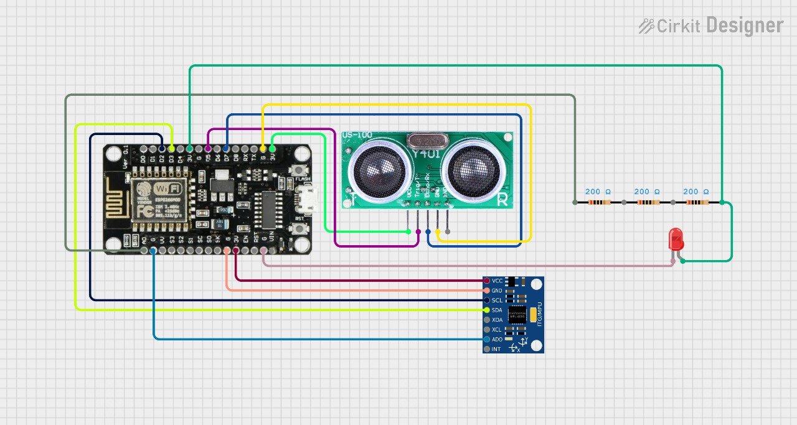

# Traject-O-Matic 🎯  
*"Because throwing things is science, if you measure it."* – GLaDOS  
*"Ah yes, another human invention. A glorified rock thrower with Wi-Fi."* – GLaDOS  

---

## 🌀 About
Traject-O-Matic is a physics measurement tool powered by **ESP8266**, **ultrasonic sensor**, **MPU6050 (accelerometer + gyroscope)**, and a **light sensor**.  
It calculates distance, acceleration, projectile motion, freefall, and gravity – in case you forgot the universe already does that for free.  

---

## ✨ Features
- 📏 **Distance Measurement** – Ultrasonic sensor: because rulers are too mainstream.  
- 🌀 **Acceleration & Gyroscope** – MPU6050: records every wobble of your shaky hands.  
- 🌌 **Projectile Motion & Freefall** – Yes, you *are* encouraged to throw it. Survival not guaranteed.  
- 💡 **Light Sensor** – Measures brightness. Unlike you.  
- 📊 **Graphical UI** – Converts boring numbers into pretty squiggles.  

---

## 🛠️ Materials Used
- **ESP8266** – the brain 🧠 (though “brain” is generous).  
- **Ultrasonic Sensor** – measures distance without you walking. Lazy.  
- **MPU6050** – detects motion and silently judges it.  
- **Light Sensor** – included to look important.  
- **UI for plotting** – so your project feels cooler than it actually is.  

---

## 🔌 Circuit-Diagram
  
*(Wires everywhere. Truly the art of chaos harnessed for science.)*  

---

## ⚡ How It Works
1. ESP8266 collects sensor data.  
2. Data is sent to a UI, where graphs pretend to make you smarter.  
3. You launch the device like a medieval siege weapon.  
4. If it survives, you get data. If it doesn’t… you get experience points.  

---

## 📸 Demo
  
*(Yes, this is the moment you realize your project looks way cooler in GIFs.)*  

---

## 🤖 Future Plans
- Add more sensors: because overcomplication is fun.  
- Cloud logging: so your bad throws are immortalized forever.  
- AI integration: device will roast you in real time while recording data.  

---

## 🧪 Utilities
- Learn about **gravity** without risking concussions from falling apples.  
- Demonstrate **motion, acceleration, and freefall** without renting NASA equipment.  
- Impress teachers, confuse classmates, and mildly entertain yourself.  

---

## 🪦 Conclusion
Congratulations, you built **Traject-O-Matic**.  
You can now:  
- Measure gravity.  
- Plot projectile motion.  
- And test the limits of physics *and* hardware durability.  

*"Truly groundbreaking. Almost as groundbreaking as when the device hits the floor."* – GLaDOS  

---

## 📜 License
MIT License.  
Copy it. Modify it. Throw it off a balcony.  
Just don’t sue me when gravity does what gravity always does.  
